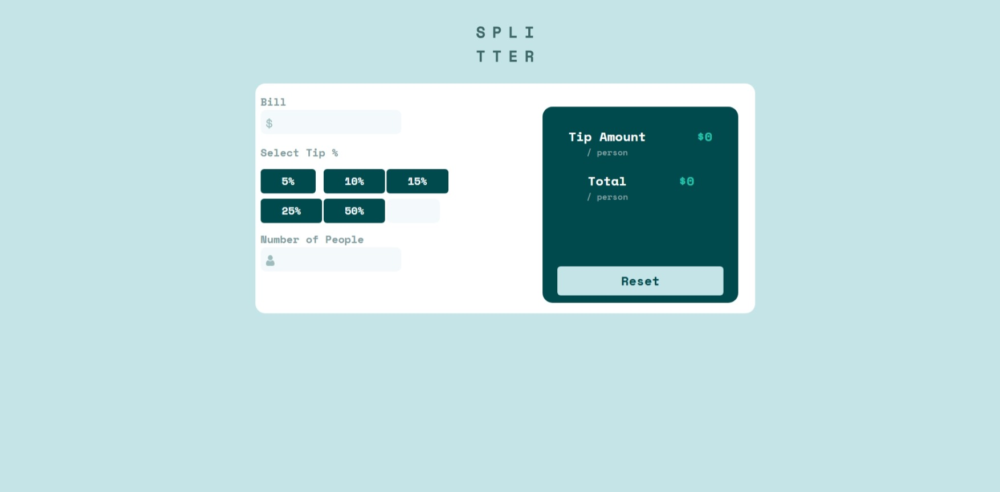

# React + Vite

This template provides a minimal setup to get React working in Vite with HMR and some ESLint rules.

Currently, two official plugins are available:

- [@vitejs/plugin-react](https://github.com/vitejs/vite-plugin-react/blob/main/packages/plugin-react/README.md) uses [Babel](https://babeljs.io/) for Fast Refresh
- [@vitejs/plugin-react-swc](https://github.com/vitejs/vite-plugin-react-swc) uses [SWC](https://swc.rs/) for Fast Refresh

## Expanding the ESLint configuration

If you are developing a production application, we recommend using TypeScript and enable type-aware lint rules. Check out the [TS template](https://github.com/vitejs/vite/tree/main/packages/create-vite/template-react-ts) to integrate TypeScript and [`typescript-eslint`](https://typescript-eslint.io) in your project.

# Frontend Mentor - Tip calculator app solution

This is a solution to the [Tip calculator app challenge on Frontend Mentor](https://www.frontendmentor.io/challenges/tip-calculator-app-ugJNGbJUX). Frontend Mentor challenges help you improve your coding skills by building realistic projects.

I did this project to sharpen my React skills. I hoped this project proved that now I am ready to work in the professional world.

Now about this README, I wrote everything starting from tools that I used, useful articles, what I had learned, and much more.

### Disclaimer

This project is solely for learning purposes. I take no any responsibility or liability for the accuracy, completeness, or usefulness of any information provided in this project. You should not use it as a reference for creating your project.

The challenge

### The challenge

Users should be able to:

- View the optimal layout for the app depending on their device's screen size
- See hover states for all interactive elements on the page
- Calculate the correct tip and total cost of the bill per person

### Screenshot

### Links

- Solution URL: (https://github.com/JudithJude369/Tip-Calculator)
- Live Site URL:(https://tip-calculator-flax-nine.vercel.app/)

## My process

### Built with

- Semantic HTML5 markup
- CSS custom properties
- Flexbox
- CSS Grid
- React
- Mobile-first workflow
- [React](https://reactjs.org/) - JS library

## Author

- Frontend Mentor - (https://www.frontendmentor.io/profile/JudithJude369)
- Twitter - (https://x.com/JudithJ08832378)

## Acknowledgments

Omololu Jumat really helped me in this project. Thank you very much, Lolu and I'm very grateful!

See his Portfolio website — (https://omololujumat.netlify.app/)
